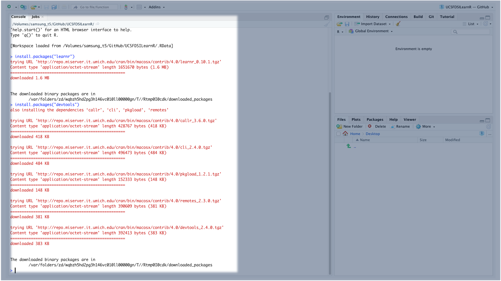

To access the module, you'll need to complete the following steps:

1.  Install learnr and devtools

2.  Load learnr and devtools

3.  Install UCSF DSI Courses

4.  Launch Courses

### Install learnr and devtools

You can skip this step of you've already previously installed *learnr* and *devtools* packages. However, there is not harm in re-installing these packages.

To install learnr and devtools, copy and paste the commands below into RStudio Console and press *Enter*.

    install.packages("learnr")
    install.packages("devtools")

### Load learnr and devtools

After you've installed *learnr* and *devtools*, you'll need to load them in your RStudio session. To do this, copy and paste the commands below into RStudio Console and press *Enter*.

    library(learnr)
    library(devtools)

### Install UCSF DSI Courses

After you'd loaded *learnr* and devtools, you can install R courses from UCSF DSI. Courses are constantly updated, and you should install the courses every time to ensure you are viewing the most up-to-date version of the course.

    devtools::install_github("UCSF-DSI/UCSFDSILearnr")

### Launch Courses

Now that the courses have been installed, you can access them in the Tutorial Pane in the top right of RStudio
