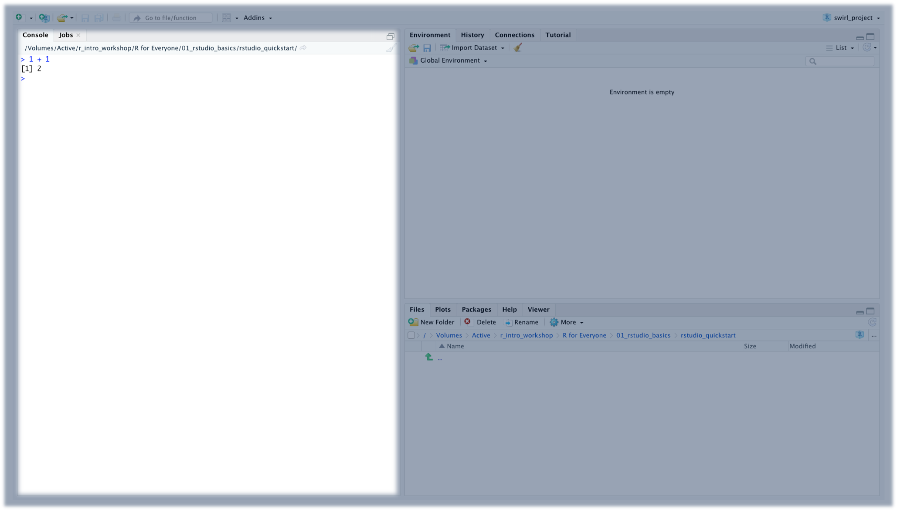

```{r setup, include=FALSE}
library(learnr)
library(knitr)
knitr::opts_chunk$set(echo = FALSE)
```

## Course Overview

Want to learn computer programming but don't know where to start? You're in the right place! You will learn basic computer programming with R, and by the end of the course module, you will be able to:

-   Describe the difference between R and RStudio.
-   Enter commands in the RStudio Console.

### Prerequisites

This course is designed for beginners, and there are no pre-requisites. However, you'll need to have some software installed:

-   [Install R](https://cran.r-project.org/)
-   [Install RStudio](https://www.rstudio.com/products/rstudio/download/)

Chances are, if you're viewing this course, you already have these installed. However, if that is not the case, take a moment to install both R and RStudio on your computer (both macOS and Windows are fine), and we'll discuss what these are later! If you already have these installed, you are good to go!

### Course Authors

-   [Karla Lindquist, PhD](http://profiles.ucsf.edu/karla.lindquist) is the Scientific Lead for the Data Science Initiative in the UCSF Library.
-   Albert Lee is an Instructional Designer and Analyst for the Data Science Initiative at the UCSF Library.

### Creative Commons

All materials and topics in this course are subject to periodical changes and updates by the Instructor. This work is licensed under a [Creative Commons Attribution-NonCommercial 4.0 International License](http://creativecommons.org/licenses/by-nc/4.0/).


## What are R and RStudio?

*Lesson Objective: Describe reasons to use RStudio to interact with R.*

{width="100%"}

You may have heard that R and RStudio are great tools for doing data science, but do you know what makes them useful? Also, what's the difference between R and RStudio?

Keep reading to learn more!

### What is R?

**R** is a programming language used frequently for data science and statistical applications.

A **programming languages** is a human-interpretable way to provide specific instructions to a computer. There are many programming languages out there, and some examples are including Python, Javascript, and C++.

R is a great option for the following reasons:

-   It is free and open source.
-   There is a large community of R users (many of whom do data science) who provide support for each other.

***Pro Tip**: Although it is useful to understand multiple programming languages, you should only learn one programming language at a time (especially if you are a beginner). Once you have mastered one programming language, then you can try learning others.*

### What is RStudio?

Now that you know more about R, it's time to learn about RStudio. **RStudio** is an integrated development environment (IDE) used to interact with R.

Although you don't have to use one, an **IDE** makes computer programming easier to do. As you learn more about RStudio, you'll see how some of its features make R programming more enjoyable.

For the most part, you will be doing R programming inside of RStudio.

### Knowledge Check

```{r KC-1, echo=FALSE}
question("TRUE or FALSE: RStudio is a programming language used frequently for data science and statistical applications.",
  answer("TRUE", message = "Not quite. RStudio is an IDE used to interact with the R programming language."),
  answer("FALSE", correct = TRUE, message = "That's right! Continue on to the next lesson to launch RStudio."),
  allow_retry = TRUE
)
```

## Launching RStudio

*Lesson Objective: Enter commands in the RStudio Console.*

Let's try launching RStudio. Go ahead and open RStudio on your computer. You should see something like this.

{width="100%"}

### RStudio Console

First, let's take a look at the Console on the left side of the window. Inside the **Console**, you can enter R commands. Try entering `1 + 1` inside the Console and then pressing *Enter*.

{width="100%"}

You can think of the Console as a calculator, and many mathematical operators are built into the R programming language. For example, try entering `2 * 4 - 6 / 2` in the Console.

```{r KC-2, echo=FALSE}
question("What does the Console print after you enter `2 * 4 - 6 / 2`?",
  answer("5", correct = TRUE, message = "You got it! R maintains standard order of operations."),
  answer("1", message = "Not quite. Try again."),
  answer("-2", message = "Not quite. Try again."),
  answer("Something else...", message = "Not quite. Try again."),
  allow_retry = TRUE
)
```

***Pro Tip**: Inside the Console, you can use the up arrow key to find and re-enter previous commands.*

At this point, the Console is the only RStudio feature you should know about. As you progress through your R learning journey, you'll learn about other RStudio features. If you want to a sneak peek at all the RStudio features available, check out this [cheatsheet](https://github.com/rstudio/cheatsheets/raw/master/rstudio-ide.pdf) by the RStudio team.

## Summary

**Key Concepts**

-   R is a programming language used frequently for data science and statistical applications.
-   RStudio is an integrated development environment (IDE) used to interact with R.
-   Inside the RStudio Console, you can enter R commands.

+------------------------------------------+--------------------------------------------------------------------------------------+
| **Vocabulary**                           | **Definition**                                                                       |
+------------------------------------------+--------------------------------------------------------------------------------------+
| R                                        | A programming language used frequently for data science and statistical applications |
+------------------------------------------+--------------------------------------------------------------------------------------+
| Programming Language                     | A human-interpretable way to provide specific instructions to a computer.            |
+------------------------------------------+--------------------------------------------------------------------------------------+
| RStudio                                  | An integrated development environment (IDE) used to interact with R                  |
+------------------------------------------+--------------------------------------------------------------------------------------+
| Integrated Development Environment (IDE) | An application that supports computer programming tasks                              |
+------------------------------------------+--------------------------------------------------------------------------------------+
| Console                                  | A space in RStudio where you can enter R commands                                    |
+------------------------------------------+--------------------------------------------------------------------------------------+

```{r echo=FALSE}
Vocabulary <- c(
  "R", 
  "Programming Lanuage", 
  "RStudio", 
  "Integrated Development Environment (IDE)", 
  "Console"
)
Definition <- c(
  "A programming language used frequently for data science and statistical applications", 
  "A human-interpretable way to provide specific instructions to a computer.", 
  "An integrated development environment (IDE) used to interact with R", 
  "An application that supports computer programming tasks", 
  "A space in RStudio where you can enter R commands"
)

vocab_table <- as.data.frame(cbind(Vocabulary, Definition))

kable(vocab_table, format='markdown')
```
