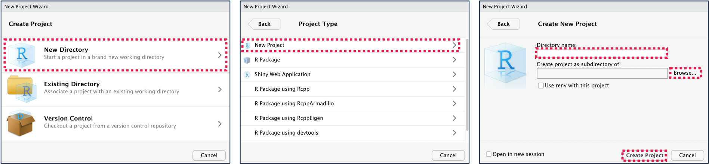
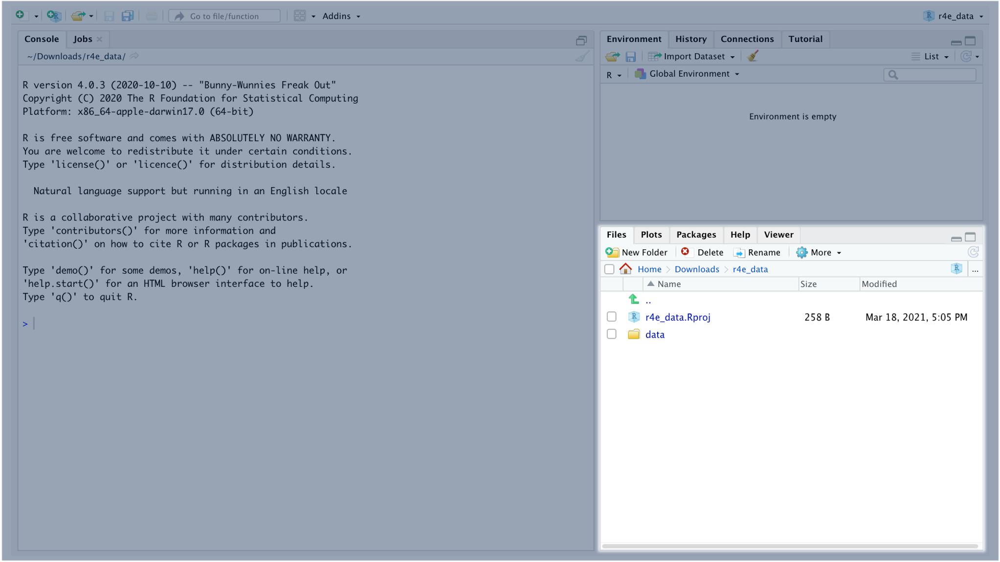
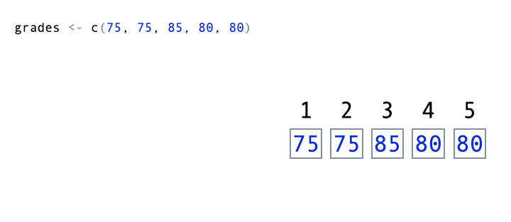

```{r setup, include=FALSE}
library(learnr)
library(knitr)
knitr::opts_chunk$set(echo = FALSE)
```

## Course Overview

It's great that you can create computer programs in R, but what should we make those computer programs do? R is used frequently for data science and statistical applications, and in this module, you'll be introduced to how R is used to work with data.

By the end of the course module, you will be able to:

-   Set up new RStudio projects.
-   Apply vector and matrix operations.
-   Load and manipulate data in data frames.

### Prerequisites

You will need to have both R and RStudio installed, and you will be viewing this course through RStudio.

Prior to completing this course module, you should have complete the other modules in the R for Everyone Series:

-   R for Everyone - Part 1: The Basics
-   R for Everyone - Part 2: Computer Programming

### Course Authors

-   [Karla Lindquist, PhD](http://profiles.ucsf.edu/karla.lindquist) is the Scientific Lead for the Data Science Initiative in the UCSF Library.
-   [Albert Lee](www.linkedin.com/in/albemlee) is an Instructional Designer and Analyst for the Data Science Initiative at the UCSF Library.

### Creative Commons

All materials and topics in this course are subject to periodical changes and updates by the Instructor. This work is licensed under a [Creative Commons Attribution-NonCommercial 4.0 International License](http://creativecommons.org/licenses/by-nc/4.0/).


## Setting Up RStudio Projects

*Lesson Objective: Set up an R Project.*

Up to this point in the R for Everyone series, you haven't needed to set up an RStudio Project. However, now that we'll start working with data, it's a good idea to get into the habit of using RStudio Projects to organize your work..

By using **RStudio Projects**, you can ensure all the data, code, and documentation for your projects are accessible in a single place.

To create a new project, go to *File -\> New Project...\** from the top menu. In the window the appears, select *New Directory -\> New Project*. Then give your project a name and choose where to save your project.

*\* Notes:*

-   *Creating or opening a new RStudio Project will close this tutorial. No worries though! You can resume this tutorial from where you left off in the new RStudio Project.*

-   *In older versions of RStudio, this may be displayed as Empty Project instead of New Project.*



This will create a new folder in the location where you chose to save your new project. In this folder, you should now see a *.Rproj* file. You can use this *.Rproj* file as a shortcut to opening your project in RStudio.

Go ahead and create a new *.Rproj* to organize your work for this course module. Inside of the project folder, create a new *data* directory. To do this, you can select *New Folder* from the menu in the **Files** pane, which is located at the bottom right of the RStudio window.

{width="100%"}

If you are completing this module within RStudio, go ahead and download [this csv file](https://drive.google.com/uc?export=download&id=1Br49EnqLiUUP-lGE2LO2ZA4WE1jVC23g), and add it to your *data* folder in your project.

## Vectors and Matrices

*Lesson Objective: Apply vector and matrix operations.*

Suppose you are a teacher, and the table below displays your students' grades.

| student  | assignment1_grade | assignment2_grade | test_grade |
|:---------|:------------------|:------------------|:-----------|
| Albert   | 80                | 90                | 65         |
| Enrico   | 90                | 85                | 70         |
| Ian      | 85                | 100               | 80         |
| Michelle | 85                | 85                | 75         |
| Namari   | 90                | 95                | 75         |

It looks like our students didn't do as well on the test. Let's try to apply a grade adjustment of 5 points to the test.

```{r exercise_02a, exercise=TRUE}
# assign grades to students
grade_albert <- 65
grade_enrico <- 70
grade_ian <- 80
grade_michelle <- 75
grade_namari <- 75

# apply 5 point grade adjustment
grade_albert <- grade_albert + 5
grade_enrico <- grade_enrico + 5
grade_ian <- grade_ian + 5
grade_michelle <- grade_michelle + 5
grade_namari <- grade_namari + 5

# display grades
print(grade_albert)
print(grade_enrico)
print(grade_ian)
print(grade_michelle)
print(grade_namari)
```

In the code above, we assigned the test grade of every student to separate objects, and then we added 5 to each object. Although this works, you may have noticed that it is repetitive. There are different objects for different student's scores, and we are applying the same mathematical operation (add 5) to all the objects. Is there a more efficient way to do this? The short answer is yes!

### Vectors

**Vectors** are sequences of values (think rows or columns of data in a table). Let's revisit the example from above, but this time, we'll use a vector.

```{r exercise_02b, exercise=TRUE}
# assign grades to students
grades <- c(65, 70, 80, 75, 75)

# apply 5 point grade adjustment
grades <- grades + 5

# display grades
print(grades)
```

As you see, we were able to store all the grades in a single object as a vector using the `c()` function, and when we applied the grade adjustment, all the grades within the vector were adjusted in a single operation.

In addition to integers, vectors can hold other types of values as well. However, each vector can only contain a single type of value.

```{r exercise_02db1, exercise=TRUE}
# vector of numeric values
print(c(1.1, 50.0, 92.562))

# vector of character values (use double quotes)
print(c("pizza", "soda pop", "garlic bread", "3"))

# vector of boolean values
print(c(TRUE, FALSE))
```

#### Indexing Vectors

You can also adjust individual values within vectors. Let's just say there was a grading error on Albert's test, and his final test grade should actually be 75. Let's see how that can be done.

```{r exercise_02csetup, include=FALSE}
grades <- c(65, 70, 80, 75, 75)
grades <- grades + 5
```

```{r exercise_02c, exercise=TRUE, exercise.setup="exercise_02csetup"}
# adjust Albert's test grade
grades[1] <- 75

# display grades
print(grades)
```

Here you see that you can **index** or select specific values within a vector by using square brackets `[ ]`. Since Albert's test grade is the first value within the *grades* vector, we use the index `[1]`. There are some other ways to index as well.

```{r exercise_02dsetup, include=FALSE}
grades <- c(65, 70, 80, 75, 75)
grades <- grades + 5
grades[1] <- 75
```

```{r exercise_02d, exercise=TRUE, exercise.setup="exercise_02dsetup"}
# index a single value
print(grades[1])

# index a sequence of values
print(grades[1:3])

# index based on a condition
print(grades[grades > 80])
```

In fact, the values inside of the square brackets are vectors as well!

-   `1` is a vector of **length** 1.

-   `1:3` is a **sequence** (`c(1, 2, 3)`).

-   `grades > 80` is a vector with boolean values (`c(FALSE, FALSE, TRUE, FALSE, FALSE)`).



#### Knowledge Check

Write some code based on the description and table below:

    Assign student names to an object (vector) named `students`
    Assign assignment 1 grades to an object (vector) named `assignment1_grades`
    Assign assignment 2 grades to an object (vector) named `assignment2_grades`

    Index the `students` vector and include only those who scored 85 and above on assignment 1 and 90 or above on assignment 2. Store the results in an object called `high_achievers` and print the results.

***Hint**: What's the result of `c(TRUE, TRUE, FALSE, FALSE) & c(TRUE, FALSE, TRUE, FALSE)?` How about `c(TRUE, TRUE, FALSE, FALSE) | c(TRUE, FALSE, TRUE, FALSE)`? Test these out in the Console to understand how logical AND and OR operations are applied to vectors.*

| student  | assignment1_grade | assignment2_grade | test_grade |
|:---------|:------------------|:------------------|:-----------|
| Albert   | 80                | 90                | 65         |
| Enrico   | 90                | 85                | 70         |
| Ian      | 85                | 100               | 80         |
| Michelle | 85                | 85                | 75         |
| Namari   | 90                | 95                | 75         |

You can reveal the solution once you are comfortable with your response

```{r KC2a, exercise=TRUE, exercise.lines=15}
# YOUR WORK HERE

# Assign student names to an object (vector) named `students`


# Assign assignment 1 grades to an object (vector) named `assignment1_grades`


# Assign assignment 2 grades to an object (vector) named `assignment2_grades`


# Index the `students` vector and include only those that scored 85 or above on assignment 1 and 90 or above on assignment 2. Store the results in an object called `high_achievers`.


# Print `high_achievers`


```

```{r KC2a-solution}
# Assign student names to an object named `students`
students <- c("Albert", "Enrico", "Ian", "Michelle", "Namari")

# Assign assignment 1 grades to an object named `assignment1_grades`
assignment1_grades <- c(80, 90, 85, 85, 90)

# Assign assignment 2 grades to an object named `assignment2_grades`
assignment2_grades <- c(90, 85, 100, 85, 95)

# Index the `students` vector and include only those that scored 85 or above on assignment 1 and 90 or above on assignment 2. Store the results in an object called `high_achievers`.
high_achievers <- students[assignment1_grades >= 85 & assignment2_grades >= 90]

# Print `high_achievers`
print(high_achievers)
```

### Matrices

As useful as vectors are, they are 1-dimensional (literally!), and most data isn't. Even with our table of students grades, the data is 2-dimensional (includes both rows and columns).

You can use **matrices** to work with 2-dimensional data. Let's take a look.

```{r exercise_02e, exercise=TRUE}
all_grades <- matrix(
  c(80, 90, 85, 85, 90, 90, 85, 100, 85, 95, 65, 70, 80, 75, 75),
  nrow = 5,
  ncol = 3
)

print(all_grades)
```

Using the `matrix()` function, we can specify the values, number of rows, and number of columns in our matrix. This isn't always practical, and as you can see above, it's hard to keep track of which values in `c(80, 90, 85, 85, 90, 90, 85, 100, 85, 95, 65, 70, 80, 75, 75)` are assignment 1 grades, assignment 2 grades, and test grades.

A better way to do this is to leverage vectors.

```{r exercise_02f, exercise=TRUE}

assignment1_grades <- c(80, 90, 85, 85, 90)
assignment2_grades <- c(90, 85, 100, 85, 95)
test_grades <- c(65, 70, 80, 75, 75)

all_grades <- cbind(assignment1_grades, assignment2_grades, test_grades)

# display grades
print(all_grades)
```

By using the `cbind()` function, we're able to make each vector a column in our new matrix. Another useful function for combining vectors into matrices is the `rbind()` function which makes each vector a row.

By using vectors to create your matrix, you make your code easier to read. You may have also notices that `cbind()` automatically named the columns of your matrix based on the names of the vectors. Likewise, `rbind()` will name the rows of your matrix based on the vector names. Let's go ahead and name the rows of the `all_grades` matrix using the students' names.

```{r exercise_02gsetup, include=FALSE}

assignment1_grades <- c(80, 90, 85, 85, 90)
assignment2_grades <- c(90, 85, 100, 85, 95)
test_grades <- c(65, 70, 80, 75, 75)

all_grades <- cbind(assignment1_grades, assignment2_grades, test_grades)
```

```{r exercise_02g, exercise=TRUE, exercise.setup="exercise_02gsetup"}

rownames(all_grades) <- c("Albert", "Enrico", "Ian", "Michelle", "Namari")
colnames(all_grades) <- c("assignment1_grades", "assignment2_grades", "test_grades")

# display grades
print(all_grades)
```

By using the `rownames()` and `colnames()` functions, we can name the rows and columns of our matrices. This makes it easier to index values in your matrix.

#### Indexing Matrices

Indexing matrices is very similar to indexing vectors, and you will use square brackets (`[ ]`) as well. However, unlike vectors, you have to index both the rows and columns of a matrix. Let's take a look at a few examples.

```{r exercise_02hsetup, include=FALSE}

assignment1_grades <- c(80, 90, 85, 85, 90)
assignment2_grades <- c(90, 85, 100, 85, 95)
test_grades <- c(65, 70, 80, 75, 75)

all_grades <- cbind(assignment1_grades, assignment2_grades, test_grades)

rownames(all_grades) <- c("Albert", "Enrico", "Ian", "Michelle", "Namari")
colnames(all_grades) <- c("assignment1_grades", "assignment2_grades", "test_grades")
```

```{r exercise_02h, exercise=TRUE, exercise.setup="exercise_02hsetup"}

# Select all columns in the first row
print(all_grades[1, ])

# Select all rows in the second column
print(all_grades[, 2])

# Select Albert, Enrico, and Namari's assignment 1 and assignment 2 grades
print(
  all_grades[
    c("Albert", "Enrico", "Namari"),
    c("assignment1_grades", "assignment2_grades")
  ]
)
```

Here are some key observations based on the examples:

-   The square brackets all follow the form of `[row_indices, column_indices]`.

-   Both row and column indices are vectors

-   To select all rows or all columns, you still need to include the comma, and you would leave out either the row indices or column indices based on what you are selecting.

-   You can index using integers (based on position within matrix) or row/column names.

Similar to vectors, you can also use logic (vector of boolean values) to index matrices.

```{r exercise_02i, exercise=TRUE, exercise.setup="exercise_02hsetup"}

# Select rows where assignment 2 grade was 90 or above (include all columns)
print(
  all_grades[all_grades[, "assignment2_grades"] >= 90, ]
)
```


#### Knowledge Check

Write some code based on the description below:

    Index the `all_grades` matrix and include only students who scored 85 or above on assignment 1 and 90 or above on assignment 2. Store the results in an object called `high_achievers` and print the results. As a bonus, try modifying `high_achievers` so it only contains the student names.

    Hint: Your results should be the same as the previous Knowledge Check's results.

| student  | assignment1_grade | assignment2_grade | test_grade |
|:---------|:------------------|:------------------|:-----------|
| Albert   | 80                | 90                | 65         |
| Enrico   | 90                | 85                | 70         |
| Ian      | 85                | 100               | 80         |
| Michelle | 85                | 85                | 75         |
| Namari   | 90                | 95                | 75         |

You can reveal the solution once you are comfortable with your response

```{r KC2b, exercise=TRUE, exercise.lines=10, exercise.setup="exercise_02hsetup"}
# YOUR WORK HERE

# Index the `all_grades` matrix and include only students who scored 85 or above on assignment 1 and 90 or above on assignment 2. Store the results in an object called `high_achievers`.


# As a bonus, try modifying `high_achievers` so it only contains the student names.


# Print `high_achievers`


```

```{r KC2b-solution}

# Index the `all_grades` matrix and include only students who scored 85 or above on assignment 1 and 90 or above on assignment 2. Store the results in an object called `high_achievers`.
high_achievers <- all_grades[
  all_grades[, "assignment1_grades"] >= 85 & all_grades[, "assignment2_grades"] >= 90,
]
# As a bonus, try modifying `high_achievers` so it only contains the student names.
high_achievers <- rownames(high_achievers)

# Print `high_achievers`
print(high_achievers)

```

## Data Frames

*Lesson Objective: Load and manipulate data in data frames.*

With a matrix, you can now work with 2-dimensional data. However, one of matrix's limitations (or feature depending on your perspective) is that all values must be the same type. However, the data you're working with often contains multiple types of values.

To explore this, go ahead and run the code below.

```{r exercise_03setup, include=FALSE}
dir.create("data")
course_records <- read.csv(url("https://raw.githubusercontent.com/UCSF-DSI/UCSFDSILearnr/main/data/course_records.csv"))
write.csv(course_records, "data/course_records.csv", row.names=FALSE)
rm(list=ls())
```

```{r exercise_03a, exercise=TRUE, exercise.setup="exercise_03setup"}
# Read data from course_records.csv and assign it to course_records
course_records <- read.csv("data/course_records.csv")
course_records
```

In the code above, we imported data from a **CSV (comma separated values)** file, using the `read.csv()` function. The data is now stored as a data frame in the *course_records* object. **Data frames** are the most common way of storing data in R, and it handles **tabular data** (data with rows and columns) with multiple data types. The *course_records* data frame contains multiple types of data:

-   The *Name* column contains strings.

-   The *Grade* column contains integers.

-   The *Week.XXX.Attendance* columns contain boolean values.

-   The *XXX.Assessment.Score* columns contain numeric (decimal) values.

***Pro Tip**: You can view your data frames in your Environment Pane, by clicking an object that contains the data frame you would like to view*

### Indexing Data Frames

Similar to vectors and matrices, we use square brackets (`[ ]`) to index data frames. In fact, indexing data frames is very similar to indexing matrices.

```{r exercise_03bsetup, include=FALSE}
course_records <- read.csv(url("https://raw.githubusercontent.com/UCSF-DSI/UCSFDSILearnr/main/data/course_records.csv"))
```

```{r exercise_03b, exercise=TRUE, exercise.setup="exercise_03bsetup"}

# Select all columns in the first row
course_records[1, ]

# Select all rows in the second column
course_records[, 2]

# Select the pre and post assessment scores from the first 10 rows
course_records[
  1:10,
  c("Pre.Assessment.Score", "Post.Assessment.Score")
]
```

Similar to indexing matrices, you can use logic to index data frames.

```{r exercise_03c, exercise=TRUE, exercise.setup="exercise_03bsetup"}

# Select students who were present during week 5
course_records[
  course_records[, "Week.5.Attendance"] == TRUE, 
  "Name"
]
```

### Knowledge Check

Consider the following scenario for this multi-part Knowledge Check.

Suppose now we want to find students who were "exceptional" throughout the course. The criteria for exceptional students are:

-   Scored higher on the post assessment than the pre assessment

-   Scored at least 0.8 on the post assessment

-   Attended at least 4 classes (*Hint: Lookup and apply the* `rowSums()` *function*)

In addition, you'll need to apply a grade adjustment and add 0.1 to both assessments prior to selecting students based on this criteria.

Let's work through this one step at a time.

#### Part A: Adjust Assessment Columns in Data Frame

First let's apply a grade adjustment and add 0.1 to both assessments.

The data is stored in `course_records`. The data for the assessments are located in the `Pre.Assessment.Score` and `Post.Assessment.Score` columns. Go ahead and use indexing to add 0.1 to all scores in both assessments. Print the updated `course_records` data frame.

```{r KC3A, exercise=TRUE, exercise.lines=10, exercise.setup="exercise_03bsetup"}
# YOUR WORK HERE

# Apply a grade adjustment of 0.1 to both assessments


# Print `course_records`


```

```{r KC3A-solution}

# Apply a grade adjustment of 0.1 to both assessments
course_records[, c("Pre.Assessment.Score", "Post.Assessment.Score")] <- course_records[, c("Pre.Assessment.Score", "Post.Assessment.Score")] + 0.1

# Print `course_records`
course_records
```

#### Part B: Create Logical Vectors Based on Criteria

Next, create logical vectors that will represent the criteria for "exceptional" students:

-   Criteria 1: Attended at least 4 classes

-   Criteria 2: Scored higher on the post assessment than the pre assessment

-   Criteria 3: Scored at least 0.8 on the post assessment

Store these vectors in `criteria_1`, `criteria_2`, `criteria_3`. We provided `criteria_1` for you (*recommendation: review the documentation for the `rowSums()` function*), but you need to write code to create `criteria_2` and `criteria_3`.

```{r KC3B, exercise=TRUE, exercise.lines=15, exercise.setup="exercise_03bsetup"}
# Apply a grade adjustment of 0.1 to both assessments
course_records[, c("Pre.Assessment.Score", "Post.Assessment.Score")] <- course_records[, c("Pre.Assessment.Score", "Post.Assessment.Score")] + 0.1

# Create criteria_1 vector (Attended at least 4 classes)
criteria_1 <- rowSums(course_records[, c("Week.1.Attendance", "Week.2.Attendance", "Week.3.Attendance", "Week.4.Attendance", "Week.5.Attendance")]) >= 4

# YOUR WORK HERE

# Create criteria_2 vector (Scored higher on the post assessment than the pre assessment)


# Create criteria_3 vector (Scored at least 0.8 on the post assessment)


```

```{r KC3B-solution}

# Apply a grade adjustment of 0.1 to both assessments
course_records[, c("Pre.Assessment.Score", "Post.Assessment.Score")] <- course_records[, c("Pre.Assessment.Score", "Post.Assessment.Score")] + 0.1

# Create criteria_1 vector (Attended at least 4 classes)
criteria_1 <- rowSums(course_records[, c("Week.1.Attendance", "Week.2.Attendance", "Week.3.Attendance", "Week.4.Attendance", "Week.5.Attendance")]) >= 4

# Create criteria_2 vector (Scored higher on the post assessment than the pre assessment)
criteria_2 <- course_records[, "Post.Assessment.Score"] - course_records[, "Pre.Assessment.Score"] > 0

# Create criteria_3 vector (Scored at least 0.8 on the post assessment)
criteria_3 <- course_records[, "Post.Assessment.Score"] >= 0.8
```

#### Part C: Use Criteria Vectors to Index Data Frame

Now we can index course_records to view "exceptional" students. Use the criteria vectors you created in Part B to select students who meet all three criteria (*hint: you'll need to use the `&` operator*). Make sure you select the `Name` column from `course_records`, and you will store the results in an object called `top_performers`.

```{r KC3C, exercise=TRUE, exercise.lines=25, exercise.setup="exercise_03bsetup"}
# Apply a grade adjustment of 0.1 to both assessments
course_records[, c("Pre.Assessment.Score", "Post.Assessment.Score")] <- course_records[, c("Pre.Assessment.Score", "Post.Assessment.Score")] + 0.1

# Create criteria_1 vector (Attended at least 4 classes)
criteria_1 <- rowSums(course_records[, c("Week.1.Attendance", "Week.2.Attendance", "Week.3.Attendance", "Week.4.Attendance", "Week.5.Attendance")]) >= 4

# Create criteria_2 vector (Scored higher on the post assessment than the pre assessment)
criteria_2 <- course_records[, "Post.Assessment.Score"] - course_records[, "Pre.Assessment.Score"] > 0

# Create criteria_3 vector (Scored at least 0.8 on the post assessment)
criteria_3 <- course_records[, "Post.Assessment.Score"] >= 0.8

# YOUR WORK HERE

# Select students who met the criteria and assign to `top_performers`


# Print `top_performers`

```

```{r KC3C-solution}

# Apply a grade adjustment of 0.1 to both assessments
course_records[, c("Pre.Assessment.Score", "Post.Assessment.Score")] <- course_records[, c("Pre.Assessment.Score", "Post.Assessment.Score")] + 0.1

# Create criteria_1 vector (Attended at least 4 classes)
criteria_1 <- rowSums(course_records[, c("Week.1.Attendance", "Week.2.Attendance", "Week.3.Attendance", "Week.4.Attendance", "Week.5.Attendance")]) >= 4

# Create criteria_2 vector (Scored higher on the post assessment than the pre assessment)
criteria_2 <- course_records[, "Post.Assessment.Score"] - course_records[, "Pre.Assessment.Score"] > 0

# Create criteria_3 vector (Scored at least 0.8 on the post assessment)
criteria_3 <- course_records[, "Post.Assessment.Score"] >= 0.8

# Select students who met the criteria and assign to `top_performers`
top_performers <- course_records[criteria_1 & criteria_2 & criteria_3, "Name"]

# Print `top_performers`
top_performers
```

## Summary

**Key Concepts**

-   By using **RStudio projects**, you can ensure all the data, scripts, and documentation for your projects are in a single place.
-   Use the `c()` function to create **vectors**.
-   For 2-dimensional data, use **matrices** if all the values are the same type and **data frames** if the values are different types.
-   Use square brackets (`[ ]`) to **index** data in vectors, matrices, and data frames.

| Vocabulary                   | Definition                                                                                       |
|------------------------------|--------------------------------------------------------------------------------------------------|
| RStudio Projects             | A RStudio feature to organize all files and settings associated with each project.               |
| Files Pane                   | A pane on the bottom right of RStudio that displays your files and directories.                  |
| Vector                       | A sequence of values.                                                                            |
| Index                        | Select specific values within a vector, matrix, or dataframe.                                    |
| Length                       | The number of values in a vector. It also refers to the number of rows in a matrix or dataframe. |
| Comma Separated Values (CSV) | A file format that stores multiple values by separating them with commas.                        |
| Tabular Data                 | Data that can be displayed in a table (rows and columns)                                         |
