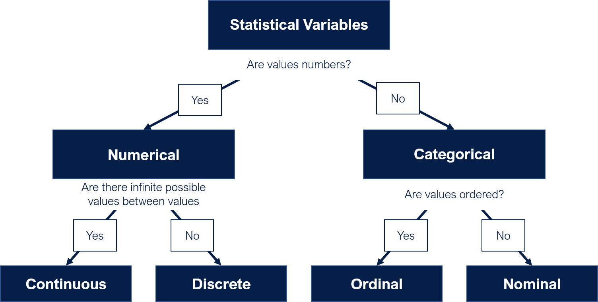

```{r setup, include=FALSE}
library(learnr)
library(knitr)
library(tidyverse)
library(ggplot2)
knitr::opts_chunk$set(echo = FALSE)
```

## Course Overview

We define **statistics** as using math to make sense of data. In this module, you will explore **descriptive statistics**, which is using statistics to describe data.

By the end of the course module, you will be able to:

-   Categorize different types of statistical variables.

-   Create and interpret visualizations to describe numerical variables.

-   Create and interpret visualizations to describe categorical variables.

-   Create and interpret visualizations to describe relationships between variables.

### Prerequisites

You will need to have both R and RStudio installed, and you will be viewing this course through RStudio.

Prior to completing this course module, you should have complete the modules in the R for Everyone Series.

### Course Authors

-   [Karla Lindquist, PhD](http://profiles.ucsf.edu/karla.lindquist) is the Scientific Lead for the Data Science Initiative in the UCSF Library.
-   [Albert Lee](www.linkedin.com/in/albemlee) is an Instructional Designer and Analyst for the Data Science Initiative at the UCSF Library.

### Creative Commons

All materials and topics in this course are subject to periodical changes and updates by the Instructor. This work is licensed under a [Creative Commons Attribution-NonCommercial 4.0 International License](http://creativecommons.org/licenses/by-nc/4.0/).


## What is Descriptive Statistics?

R is often referred to as a "statistical" programming language because it is often used for statistics. Having an understanding of statistical thinking is essential to doing data science work with R.

We define **statistics** is using math to make sense of data. There are two general types of statistics:

-   **Descriptive Statistics**: Using statistics to [describe]{.ul} your data.

-   **Inferential Statistics**: Using statistics to [infer]{.ul} information beyond your data.

In this module, we'll focus on descriptive statistics, so if the definition of inferential statistics doesn't make complete sense to you yet, that's okay! In *R for Statistics - Part 2: Inferential Statistics*, we'll spend more time differentiating between descriptive and inferential statistics.

### Types of Variables

Let's start by taking a look at a data set. If you are following along in the RStudio console, go ahead and download [this csv file](https://drive.google.com/uc?export=download&id=1YeBAn8geVfBL57WKo9ymGGxZ1QXXSqWj), and add it to a RStudio project folder. Run the code below to view the first few rows in this data set of video games.

```{r exercise_01setup, include=FALSE}
# Data from https://think.cs.vt.edu/corgis/csv/billionaires/
billionaires <- read_csv("https://think.cs.vt.edu/corgis/datasets/csv/billionaires/billionaires.csv")
billionaires <- billionaires %>% 
  filter(
    year == "2014"
  ) %>%
  rename(
    name = "name", 
    company_founded = "company.founded", 
    company_sector = "company.sector", 
    age = "demographics.age", 
    gender = "demographics.gender", 
    citizenship_country = "location.citizenship",
    net_worth = "wealth.worth in billions", 
    inheritance_source = "wealth.how.inherited"
  ) %>%
  select(
    name, 
    company_founded, 
    company_sector, 
    age, 
    gender, 
    citizenship_country, 
    net_worth, 
    inheritance_source
  ) 

write.csv(billionaires, "billionaires.csv", row.names=FALSE)
rm(list=ls())
```

```{r exercise_01a, exercise=TRUE, exercise.setup="exercise_01setup"}
billionaires <- read.csv('billionaires.csv')

# Use the `head()` function to view first 10 rows of `video_games`
head(billionaires, 10)
```

The first thing you'll learn to describe in this data are its variables. **Statistical variables** are characteristics or attributes of an entity of interest, and they are usually represented as columns within a data table. It's important to note that this is different from the object/variable concept in computer programming, and when the term variable is used, you should pay attention to whether it's being used in a statistical or computer programming context.

In this data, the entity of interest (represented as each row) is billionaires, and the table below lists the variables associated with billionaires.

+---------------------+--------------------------------------------------------------------------------------------------------------------------------------------------------------------------------+
| Column              | Description (Taken from [CORGIS](https://think.cs.vt.edu/corgis/csv/billionaires/))                                                                                            |
+:====================+:===============================================================================================================================================================================+
| name                | "The name of the billionaire."                                                                                                                                                 |
+---------------------+--------------------------------------------------------------------------------------------------------------------------------------------------------------------------------+
| company_founded     | "The year that the company was founded."                                                                                                                                       |
+---------------------+--------------------------------------------------------------------------------------------------------------------------------------------------------------------------------+
| company_sector      | "The sector of the business, or what segment of the economy they fit into."                                                                                                    |
+---------------------+--------------------------------------------------------------------------------------------------------------------------------------------------------------------------------+
| age                 | "The current age of the billionaire. Ages that are represented as -1 stand for ages that were not available in the data that was collected."                                   |
+---------------------+--------------------------------------------------------------------------------------------------------------------------------------------------------------------------------+
| gender              | "A string representing their gender."                                                                                                                                          |
+---------------------+--------------------------------------------------------------------------------------------------------------------------------------------------------------------------------+
| citizenship_country | "The name of the country that this billionaire has citizenship with."                                                                                                          |
+---------------------+--------------------------------------------------------------------------------------------------------------------------------------------------------------------------------+
| net_worth           | "The number of billion of dollars that this billionaire is worth."                                                                                                             |
+---------------------+--------------------------------------------------------------------------------------------------------------------------------------------------------------------------------+
| inheritance_source  | "The way that this money was inherited (or not inherited). Inheritance can come from a spouse, the father, or from multiple generations within a family (either 3, 4, or 5+)." |
+---------------------+--------------------------------------------------------------------------------------------------------------------------------------------------------------------------------+

There are two main types of statistical variables: numerical and categorical.

**Numerical variables** are variables that contains numbers. There are two subtypes of numerical variables: continuous and discrete. **Continuous variables** are variables where there can be an infinite number of values between any two values. Usually, variables that contain decimal numbers are continuous variables. **Discrete variables** are variables where values are separated by specific intervals. Integers are a common example of discrete variables.

**Categorical Variables** are variables that do not contain numbers. The two types of categorical variables are ordinal and nominal. **Ordinal variables** contain categories that are ordered. A common example of an ordinal variable are Likert scales and other types of ratings. **Nominal variables** contain categories that are not ordered.

Below is a summary of the types of statistical variables:



It's important to identify the type of variables you are working with because it provides a framework to determine the type of analysis you can apply to the variable. In the next few lessons, you'll learn about different ways of applying descriptive statistics, and the types of analysis you can apply to a numerical variable are different than your options for a categorical variable.

### Knowledge Check

```{r exercise_01b, echo=FALSE}
quiz(
  caption = "Identify the variable type for each columns in `video_games`:",
  question("What type of variable is `citizenship_country`?",
    answer("Numerical: Continuous"),
    answer("Numerical: Discrete"),
    answer("Categorical: Nominal", correct = TRUE),
    answer("Categorical: Ordinal"),
    allow_retry = TRUE
  ),
  question("What type of variable is `age`?",
    answer("Numerical: Continuous"),
    answer("Numerical: Discrete", correct = TRUE),
    answer("Categorical: Nominal"),
    answer("Categorical: Ordinal"),
    allow_retry = TRUE
  ),
  question("What type of variable is `net_worth`?",
    answer("Numerical: Continuous", correct = TRUE),
    answer("Numerical: Discrete"),
    answer("Categorical: Nominal"),
    answer("Categorical: Ordinal"),
    allow_retry = TRUE
  ),
  question("What type of variable is `inheritance_source`?",
    answer("Numerical: Continuous"),
    answer("Numerical: Discrete"),
    answer("Categorical: Nominal"),
    answer("Categorical: Ordinal", correct = TRUE),
    allow_retry = TRUE
  )
)
```

Other variables types: time

## Describing Numerical Variables

```{r exercise_02setup, include=FALSE}
# Data from https://think.cs.vt.edu/corgis/csv/billionaires/
billionaires <- read_csv("https://think.cs.vt.edu/corgis/datasets/csv/billionaires/billionaires.csv")
billionaires <- billionaires %>% 
  filter(
    year == "2014"
  ) %>%
  rename(
    name = "name", 
    company_founded = "company.founded", 
    company_sector = "company.sector", 
    age = "demographics.age", 
    gender = "demographics.gender", 
    citizenship_country = "location.citizenship",
    net_worth = "wealth.worth in billions", 
    inheritance_source = "wealth.how.inherited"
  ) %>%
  select(
    name, 
    company_founded, 
    company_sector, 
    age, 
    gender, 
    citizenship_country, 
    net_worth, 
    inheritance_source
  ) 
```

```{r exercise_02a, exercise=TRUE, exercise.setup="exercise_02setup"}
# Create a histogram of the net_worth variable with 30 bins and assign it to net_worth_hist
net_worth_hist <- ggplot(billionaires, aes(x= net_worth)) + 
  geom_histogramaes(net_worth), bins = 30) +
  ggtitle("Histogram of Billionaire Net Worths") +
  xlab("Net Worth (Billions)") + 
  ylab("Count")

# Display net_worth_hist
net_worth_hist
```

```{r exercise_02b, exercise=TRUE, exercise.setup="exercise_02setup"}
# Filter the billionaires to only include data that provided age (hint: what does age == -1 mean?). Assign the results to billionaires_with_age
billionaires_with_age <- billionaires %>%
  filter(age > 0)

# Create a histogram of the age variable with 30 bins and assign it to age_hist
age_hist <- ggplot(billionaires_with_age, aes(x = age)) + 
  geom_histogram(bins = 30)

# Add a title and axis labels to age_hist
age_hist <- age_hist +
  ggtitle("Histogram of Billionaire Ages") +
  xlab("Age") + 
  ylab("Count")

# Add a vertical line where the mean of age is
age_hist <- age_hist +
  geom_vline(xintercept = mean(pull(billionaires_with_age, age)), color = "red")

# Add a vertical line where the median of age is
age_hist <- age_hist +
  geom_vline(xintercept = median(pull(billionaires_with_age, age)), color = "blue")

# Annotate the plot
age_hist <- age_hist + 
  annotate(geom = "text", label = "The mean is 63.34214", color = "red", x = 75, y = 140) + 
  annotate(geom = "text", label = "The median is 63", color = "blue", x = 50, y = 140) +
  annotate(geom = "text", label = "The data is symmetric.", x = 30, y = 125)

# Display age_hist
age_hist
```

```{r exercise_02c, exercise=TRUE, exercise.setup="exercise_02setup"}
# Filter the billionaires to only include data that provided age (hint: what does age == -1 mean?). Assign the results to billionaires_with_age
billionaires_with_age <- billionaires %>%
  filter(age > 0)

# Create a bar plot of the age variable with a bar width of 0.8 and assign it to age_bar
age_bar <- ggplot(billionaires_with_age, aes(x = age)) + 
  geom_bar(width = 0.8) + 
  ggtitle("Bar Plot of Billionaire Ages") +
  xlab("Age") + 
  ylab("Count")

# Display age_bar
age_bar
```

## Describing Categorical Variables

## Describing Relationships Between Variables

## Summary

**Key Concepts**

-   One of the main types of statistics is **descriptive statistics**, which is using statistics to describe data.

-   The two main types of statistical variables are **numerical** and **categorical**.

    -   The two types of numerical variables are **discrete** and **continuous**.

    -   The two types of categorical variables are **ordinal** and **nominal**.

+------------------------------------+----------------------------------------------------------------------------------------------------------------------------------------------------------------------------------------------------------+
| Vocabulary                         | Definition                                                                                                                                                                                               |
+:===================================+:=========================================================================================================================================================================================================+
| Statistics                         | Using math to make sense of data.                                                                                                                                                                        |
+------------------------------------+----------------------------------------------------------------------------------------------------------------------------------------------------------------------------------------------------------+
| Descriptive Statistics             | Use statistics to describe your data.                                                                                                                                                                    |
+------------------------------------+----------------------------------------------------------------------------------------------------------------------------------------------------------------------------------------------------------+
| Inferential Statistics             | Use statistics to infer information beyond your data.                                                                                                                                                    |
+------------------------------------+----------------------------------------------------------------------------------------------------------------------------------------------------------------------------------------------------------+
| Variables (Statistics)             | Characteristics or attributes of an entity of interest. These are usually represented as columns within a data table. *Note: Avoid confusing this with variable/object concept in computer programming.* |
+------------------------------------+----------------------------------------------------------------------------------------------------------------------------------------------------------------------------------------------------------+
| Numerical (Quantitative) Variable  | A variables that contains numbers.                                                                                                                                                                       |
+------------------------------------+----------------------------------------------------------------------------------------------------------------------------------------------------------------------------------------------------------+
| Categorical (Qualitative) Variable | A variable that does not contain numbers (e.g. categories, text, etc).                                                                                                                                   |
+------------------------------------+----------------------------------------------------------------------------------------------------------------------------------------------------------------------------------------------------------+
| Discrete Variable                  | A numerical variable that can only contain values separated by specific intervals.                                                                                                                       |
+------------------------------------+----------------------------------------------------------------------------------------------------------------------------------------------------------------------------------------------------------+
| Continuous Variable                | A numerical variable where there are an infinite number of possible values between any two values.                                                                                                       |
+------------------------------------+----------------------------------------------------------------------------------------------------------------------------------------------------------------------------------------------------------+
| Ordinal Variable                   | A categorical variable that contains ordered values.                                                                                                                                                     |
+------------------------------------+----------------------------------------------------------------------------------------------------------------------------------------------------------------------------------------------------------+
| Nominal Variable                   | A categorical variable that contains non-ordered values.                                                                                                                                                 |
+------------------------------------+----------------------------------------------------------------------------------------------------------------------------------------------------------------------------------------------------------+
| Histogram                          | A visualization that displays the shape of data by representing the frequency of ranges of values as bars.                                                                                               |
+------------------------------------+----------------------------------------------------------------------------------------------------------------------------------------------------------------------------------------------------------+
| Bar (Column) Plot                  | A visualization that displays the shape of data by representing the frequency of specific values as bars.                                                                                                |
+------------------------------------+----------------------------------------------------------------------------------------------------------------------------------------------------------------------------------------------------------+
| Measure of Center                  | Statistics that describe the center or typical value in the data.                                                                                                                                        |
+------------------------------------+----------------------------------------------------------------------------------------------------------------------------------------------------------------------------------------------------------+
| Mean (Average)                     | The sum of the data divided by the number of values.                                                                                                                                                     |
+------------------------------------+----------------------------------------------------------------------------------------------------------------------------------------------------------------------------------------------------------+
| Median                             | The middle of a ordered sequence of values.                                                                                                                                                              |
+------------------------------------+----------------------------------------------------------------------------------------------------------------------------------------------------------------------------------------------------------+
| Mode                               | The value that appears most in the data.                                                                                                                                                                 |
+------------------------------------+----------------------------------------------------------------------------------------------------------------------------------------------------------------------------------------------------------+
| Modality                           | The number of "meaningful peaks" in your data.                                                                                                                                                           |
+------------------------------------+----------------------------------------------------------------------------------------------------------------------------------------------------------------------------------------------------------+
| Skewness                           | A description of whether the data is symmetrical.                                                                                                                                                        |
+------------------------------------+----------------------------------------------------------------------------------------------------------------------------------------------------------------------------------------------------------+
|                                    |                                                                                                                                                                                                          |
+------------------------------------+----------------------------------------------------------------------------------------------------------------------------------------------------------------------------------------------------------+
|                                    |                                                                                                                                                                                                          |
+------------------------------------+----------------------------------------------------------------------------------------------------------------------------------------------------------------------------------------------------------+

**References**

-   Whitcomb, Ryan. *Billionaires CSV File*. <https://think.cs.vt.edu/corgis/csv/billionaires/>
