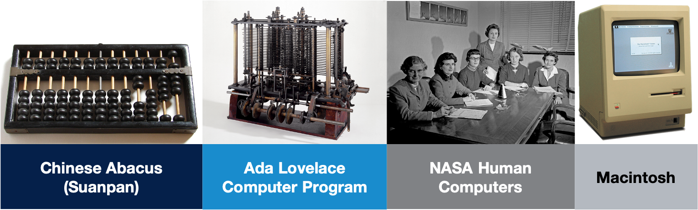
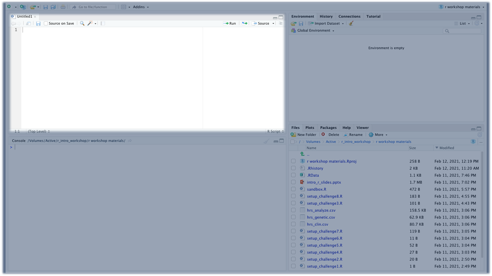
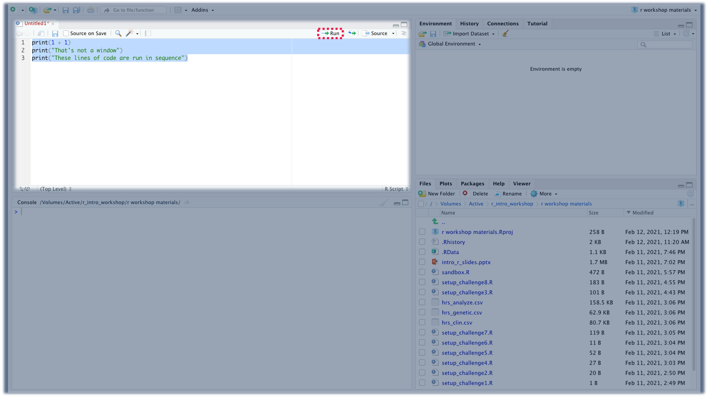
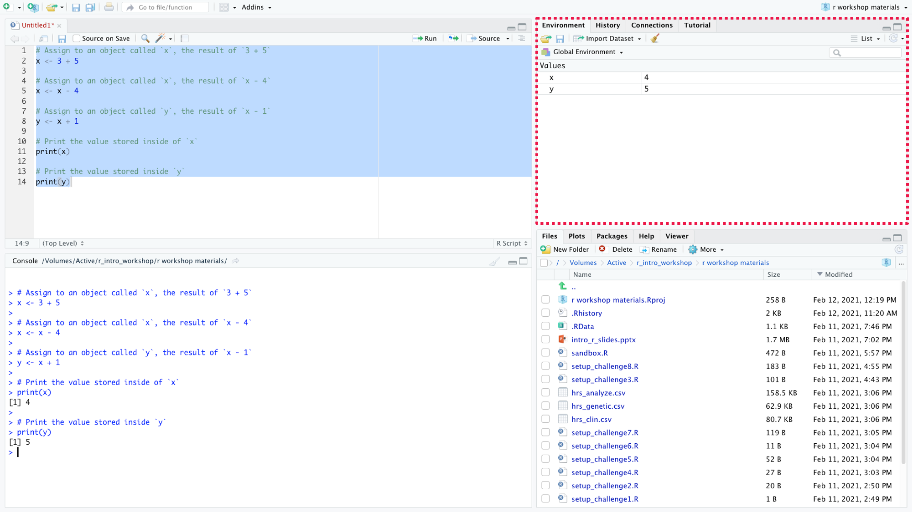
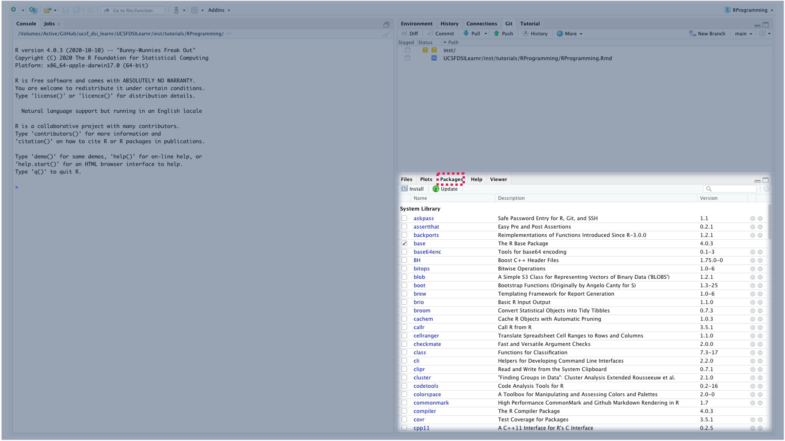
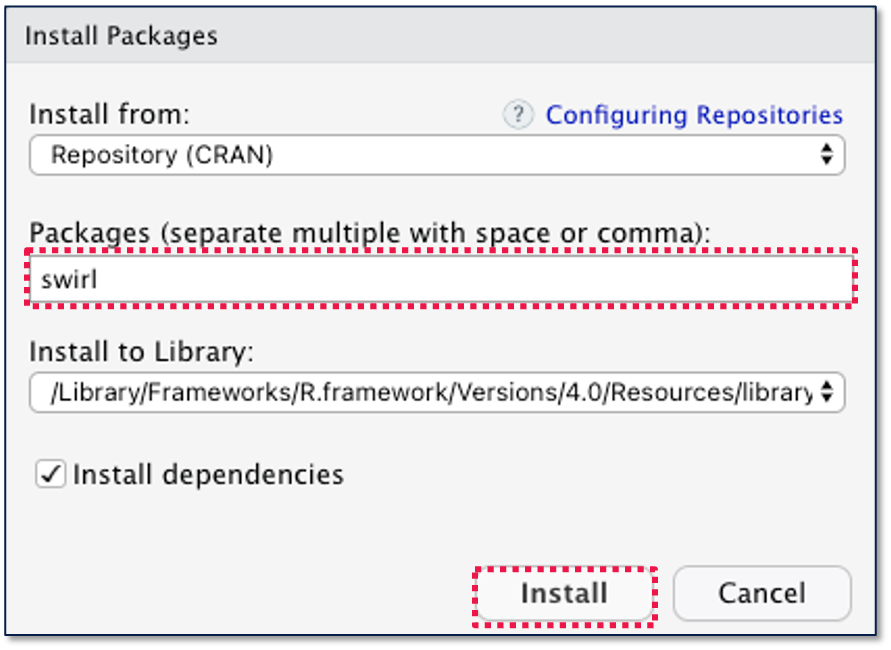

```{r setup, include=FALSE}
library(learnr)
library(knitr)
knitr::opts_chunk$set(echo = FALSE)
```

## Course Overview

You now know a little bit more about R and RStudio, and at this point, you should be able to use the RStudio Console as a calculator. You may be unaware, but by entering commands into the RStudio Console, you are doing computer programming!

Of course, there is a lot more to computer programming than just entering mathematical commands into a calculator, and this course module will introduce you to more computer programming concepts. By the end of the course module, you will be able to:

-   Create and run R scripts.
-   Store values inside of objects (variables).
-   Apply conditional logic using if...else statement.
-   Create loops to add iterative flows.
-   Define and call functions.

### Prerequisites

Prior to completing this course module, you should have already completed "R for Everyone - Part 1: The Basics." If you have not completed that course module yet, please start there.

You will need to have both R and RStudio installed, and we recommend accessing this course module through RStudio.

### Course Authors

-   [Karla Lindquist, PhD](http://profiles.ucsf.edu/karla.lindquist) is the Scientific Lead for the Data Science Initiative in the UCSF Library.
-   Albert Lee is an Instructional Designer and Analyst for the Data Science Initiative at the UCSF Library.

### Creative Commons

All materials and topics in this course are subject to periodical changes and updates by the Instructor. This work is licensed under a [Creative Commons Attribution-NonCommercial 4.0 International License](http://creativecommons.org/licenses/by-nc/4.0/).


## What is Computer Programming?

*Lesson Objective: Create and run R scripts.*

Many people describe **computer programming** (often called **coding**) as creating executable instructions for computers. Let's unpack this.

### What are Computers?

> Computers do computing...

This may seem trivial, but let's first think about what computers are. Simply put, **computers** do computing, and one of the first images that may come to mind as you think about computers is the device you are interacting with right now.

However, computers encompass so much more. After all, this device you are interacting with isn't the only thing that did computing throughout history.

-   In 160-220, The Chinese used the Abacus (Suanpan) to do computing.
-   In the 1840s, Ada Lovelace created the first computer program using an "Analytical Engine"
-   In the 1950s, NASA hired people "computers" to do computing to help launch stuff into space.
-   In the 1980s, Apple came out with the Macintosh which was the first "personal computer."

{width="100%"}

Why does this matter? Your executable instructions, also called **computer programs**, are not only meant to be consumed by computing devices. Computer programs are designed to be interpreted by other "human" computers too. After all, we use programming languages because they are *human-interpretable* ways to provide instructions to computers.

### Computer Programming with R Scripts

One of the most common mediums for you to create computer programs with R is an R Script. In the RStudio Console, you can only enter a single R command at a time, but with **R Scripts**, you can include multiple commands to be run in sequence repeatedly.

To create an R Script in RStudio, go to *File* -\> *New File* -\> *R Script*. You should now see a new **Source Editor** pane appear above the Console.

{width="100%"}

Enter the following lines of code into the Source Editor:

    print(1 + 1)
    print("That's not a window")
    print("These lines of code are run in sequence")

Select all the code you entered, and then select *Run*.

{width="100%"}

You should then see the Console run all the code you entered into your R script. You can also run individual lines of code by selecting only a single line before selecting *run*.

If you would like to re-use your code, be sure to save your R script. Then, the next time you open RStudio, you will be able to open the existing R Script and run it.

### Knowledge Check

```{r KC-1, echo=FALSE}
question("TRUE or FALSE: My R Scripts can look sloppy as long as RStudio is able to run it.",
  answer("TRUE", message = "Not quite. Think about all the *computers* you are creating computer programs for."),
  answer("FALSE", correct = TRUE, message = "That's right. You should strive to make your computer programs should be interpretable by other humans as well."),
  allow_retry = TRUE
)
```

## Storing Values in Objects

*Lesson Objective: Store values inside of objects (variables).*

We will begin with a quick warm-up exercise. Go ahead and run the code below, and then answer the two quiz questions.

```{r exercise_01a, exercise=TRUE}
# Assign to an object called `x`, the result of `3 + 5`
x <- 3 + 5

# Assign to an object called `x`, the result of `x - 4`
x <- x - 4

# Assign to an object called `y`, the result of `x - 1`
y <- x + 1

# Print the value stored inside of `x`
print(x)

# Print the value stored inside `y`
print(y)
```

```{r exercise_01b, echo=FALSE}
quiz(
  caption = "Answer the following questions:",
  question("what is the value of x?",
    answer("8"),
    answer("4", correct = TRUE),
    answer("5"),
    answer("Something else"),
    allow_retry = TRUE
  ),
  question("what is the value of y?",
    answer("8"),
    answer("4"),
    answer("5", correct = TRUE),
    answer("Something else"),
    allow_retry = TRUE
  )
)

```

***Pro Tip**: The lines of code that start with `#` are called comments. **Comments** are annotations you include in your code to help humans (including yourself!) better understand your thought process, and computers will ignore your comments when running your code.*

### What are Objects?

**Objects** (also called **Variables**) stored values for later use. In the warm-up exercise, `x` and `y` were the objects, and we used the **assignment operator** (`<-`) to assign values to them. As you saw, objects can be used in mathematical operations, and you can rewrite and update the values stored in objects.

You can choose any name for objects, but here are a few rules about object naming in R:

-   Object names cannot include spaces (e.g. `num obj`) or mathematical operators (`num-obj`).
-   Object names cannot start with underscores or numbers (e.g. `_obj` and `2obj`).
-   Object names can include upper/lower case letters, numbers, underscores, and periods.
-   Object names are case sensitive (e.g. `num_obj` and `Num_obj` are not the same).

Here are our styling recommendations when creating object names:

-   Use **snake_case**:

    -   All lower case letters
    -   use `_` to separate words

-   Use nouns that describe the value that the object contains

    -   Avoid using verbs as object names (until you learn about functions). You'll understand the reasoning later when you learn about *functions*.

\***Pro Tip**: As we mentioned, it's important to make your code easy to read and interpret. One way to do that is to follow a style guide. Our R styling recommendations will be based on [this style guide](http://adv-r.had.co.nz/Style.html) by Hadley Wickham.

### The RStudio Environment Pane

Now try running the code from the warm-up exercise inside of RStudio. We recommend applying what you previously learned and running it all from a R Script.

    # Assign to an object called `x`, the result of `3 + 5`
    x <- 3 + 5

    # Assign to an object called `x`, the result of `x - 4`
    x <- x - 4

    # Assign to an object called `y`, the result of `x - 1`
    y <- x + 1

    # Print the value stored inside of `x`
    print(x)

    # Print the value stored inside `y`
    print(y)

After you run the code, you should see some changes in the top-right pane in RStudio.

{width="100%"}

This area is called the **Environment** pane, and as you can see, it displays a list of objects and their values. The Environment pane is another useful feature in the RStudio IDE that will make computer programming more enjoyable.

### Knowledge Check

```{r KC1, echo=FALSE}
quiz(
  caption = "Answer the following questions:",
  question("Which of the following are valid object names? Select all that apply.",
    answer("`blood_pressure`", correct = TRUE),
    answer("`bp`"),
    answer("`bloodPressure`"),
    answer("`measure_BP`"),
    allow_retry = TRUE
  ),
  question("Which of the following object names follow our styling recommendations?",
    answer("`blood_pressure`", correct = TRUE),
    answer("`bp`", message = "Not quite. Without more context, you cannot tell what `bp` represents."),
    answer("`bloodPressure`", message = "Not quite. This type of naming is called **camelCase**, and it's more commonly used for other programming languages. Although you might occasionally see others using it in R, we don't recommend it because the more common practice in data science is to use snake_case."),
    answer("`measure_BP`", message = "Not quite. This object name starts with a verb."),
    allow_retry = TRUE
  )
)

```

## Applying Logic with Conditions

*Lesson Objective: Apply conditional logic using if...else statement.*

Up to this point, the computer programs (R scripts) you created all executed sequentially. In other words, R ran your code in order for top to bottom.

In many cases, you may want your code to run differently, and you need to apply **control structures** to control the order in which R runs your code. The first type of control structure you'll learn about is the condition.

### What is a Condition?

In real life, conditions indicate situations or circumstances that must be true in order for something to happen. Below are some examples of statements with conditions (conditions are *italicized*): - "Make sure to drip your faucets *when the temperature drops below 15 degrees Fahrenheit*." - "We cannot run a marathon unless *we prepare and train regularly*." - "*If you have a question*, please raise your hand."

In computer programming, **conditions** indicate something that must be true in order for some code to be executed. Notice how the words *must be true* appears in our definition of conditions in both real life and computer programming. Let's dig a little deeper and see how we determine whether something is true in computer programming.

### Evaluating TRUE and FALSE with Boolean Expressions

To determine whether something is true we use boolean expressions. **Boolean** expressions result in boolean values, and boolean values are values that are either `TRUE` or `FALSE` . Similar to other types of values, boolean values can be stored inside of objects. Let's take a look at some boolean values and expressions below.

```{r exercise_02a, exercise=TRUE}
# Assign to an object called `x`, the result of `1 == 1`
x <- 1 == 1

# Assign to an object called `y`, the result of `2 < 1`
y <- 2 < 1

# Print the value stored inside of `x`
print(x)

# Print the value stored inside `y`
print(y)
```

```{r exercise_02b, echo=FALSE}
quiz(
  caption = "Answer the following questions:",
  question("what is the value of x?",
    answer("TRUE", correct = TRUE),
    answer("FALSE"),
    answer("1"),
    answer("2"),
    allow_retry = TRUE
  ),
  question("what is the value of y?",
    answer("TRUE"),
    answer("FALSE", correct = TRUE),
    answer("1"),
    answer("2"),
    allow_retry = TRUE
  )
)

```

The `==` and `<` operators are just two examples of operators that produce boolean values. There are others, and they are listed below:

```{r echo=FALSE}
Operator <- c(
  "`<`", 
  "`<=`", 
  "`>`",
  "`>=`",
  "`==`",
  "`!=`",
  "`!`",
  "<code>&#124;</code>",
  "`&`"
)
Description <- c(
  "**Less than**: TRUE if the left value is less than the right value.", 
  "**Less than or equal to**: TRUE if the left value is less than or equal to the right value.", 
  "**Greater than**: TRUE if the left value is greater than the right value.",
  "**Greater than or equal to**: TRUE if the left value is greater than or equal to the right value.",
  "**Equal to**: TRUE if the left value is equal to the right value.",
  "**Not equal to**: TRUE if the left value is not equal to the right value.",
  "**Not**: TRUE if the value is FALSE, FALSE if the value is TRUE.",
  "**Or**: TRUE if either the left value or right value are TRUE.",
  "**And**: TRUE if both the left value and right value are TRUE."
)
Example <- c(
  "`1 < 2 #This is TRUE`",
  "`1 <= 1 #This is FALSE`",
  "`1 > 1 #This is FALSE`",
  "`3 >= 2 #This is TRUE`",
  "`3 == 2 #This is FALSE`",
  "`1 != 1 #This is FALSE`",
  "`! TRUE #This is FALSE`",
  "<code>TRUE &#124; FALSE #This is TRUE<code>",
  "`TRUE & FALSE #This is FALSE`"
)

vocab_table <- as.data.frame(cbind(Operator, Description, Example))

kable(vocab_table, format='markdown')
```

Similar to other operators, these operators can be used with variables (e.g. `x <= y`).

### If...Else Statements

Now that you know about boolean expressions, you're ready to learn about conditions in R. Specifically, you'll learn about **if...else** statements.

The most basic form of an if...else statement executes some code if a boolean expression is TRUE. To do this, you'll need to use `if`. Take a look below:

```{r exercise_02c, exercise=TRUE}
# Assign to an object named `x` the value `1`
x <- 1

if (x > 0){     # Check whether `x` is greater than `0`
  x <- x + 1    # if `x > 0` is TRUE, then add `1` to `x`
}

# Print the value stored in `x`
print(x)
```

Sometimes, you may want to do something else if the boolean expression turns out to be FALSE. To do this, you'll need to include an `else`. Take a look below:

```{r exercise_02d, exercise=TRUE}
# Assign to an object named `y` the value `10`
y <- 10

if (y < 5){     # Check whether `y` is less than `5`
  y <- y * 50   # If `y < 5` is TRUE, multiply `y` by `50`
} else {        # Otherwise...
  y <- 1        # Assign `1` to `y`
}

print(y)
```

In other cases, you may want to check multiple conditions and perform different actions depending on which is TRUE. To do this, you'll need to use `else if`. Take a look below:

```{r exercise_02e, exercise=TRUE}
# Assign to an object named `z` the value `50`
z <- 50

if (z > 5){               # Check whether `z` is greater than `5`
  z <- z * 50             # If `z > 5` is TRUE, then multiply `z` by `50`
} else if (z > 200){      # Otherwise, check if `z > 200`
  z <- 50                 # If `z > 200` is TRUE, Assign `50` to `z`
} else {                  # Otherwise...
  z <- 1                  # If none of the conditions above are TRUE, assign `1` to `z`
}

print(z)
```

You can have multiple `else if`s chained together if you have many conditions to evaluate.

Generalizing what you saw in the above scenarios, conditional statements in R take the **if...else** form below:

    if (boolean_expression){

      # Execute some_code if `boolean_expression` is `TRUE`
      some_code 
      
    } else if (another_boolean_expression){

      # Execute `some_other_code` if `boolean_expression` is `FALSE` and `another_boolean_expression` is `TRUE`
      some_other_code 
      
    } else {

      # Execute `some_more_code` if all the above conditions are `FALSE`
      some_more_code 
      
    }

### Knowledge Check

Write some code based on the description below:

    Subtract 85 from 100 and assign the result to an object named `score`
    If score is 90 or above, assign 'A' to an object named `grade`
    Otherwise if the `score` is 80 or above, assign 'B' to an object named `grade`
    Otherwise if the `score` is 70 or above, assign 'C' to an object named `grade`
    Otherwise if the `score` is 60 or above, assign 'D' to an object named `grade`
    Otherwise if the `score` is below 60, assign 'Hidden' to an object named `grade`
    Print the value stored in `grade`

You can reveal the solution once you are comfortable with your response

```{r KC2, exercise=TRUE, exercise.lines=15}
# YOUR WORK HERE
```

```{r KC2-solution}
# Subtract 85 from 100 and assign the result to an object named `score`
score = 100 - 85

if (score >= 90){          # If score is 90 or above, assign 'A' to an object named `grade`
  grade <- "A"
} else if (score >= 80){   # Otherwise if the `score` is 80 or above, assign 'B' to an object named `grade`
  grade <- "B"
} else if (score >= 70){   # Otherwise if the `score` is 70 or above, assign 'C' to an object named `grade`
  grade <- "C"
} else if (score >= 60){   # Otherwise if the `score` is 60 or above, assign 'D' to an object named `grade`
  grade <- "D"
} else{                   # Otherwise if the `score` is below 60, assign 'Hidden' to an object named `grade`
  grade <- Hidden
}

# Print the value stored in `grade`
print(grade)
```

## Repeat Code with Loops

*Lesson Objective: Create loops to add iterative flows.*

Take a look at the code below. Try to determine the resulting value of `x` without running the code.

```{r exercise_03a, exercise=TRUE}
x <- 1

if (x < 20){
  x <- x + 1
}

if (x < 20){
  x <- x + 1
}

if (x < 20){
  x <- x + 1
}

if (x < 20){
  x <- x + 1
}

if (x < 20){
  x <- x + 1
}

if (x < 20){
  x <- x + 1
}

if (x < 20){
  x <- x + 1
}

if (x < 20){
  x <- x + 1
}

if (x < 20){
  x <- x + 1
}

if (x < 20){
  x <- x + 1
}

if (x < 20){
  x <- x + 1
}

if (x < 20){
  x <- x + 1
}

if (x < 20){
  x <- x + 1
}

if (x < 20){
  x <- x + 1
}

if (x < 20){
  x <- x + 1
}

if (x < 20){
  x <- x + 1
}

if (x < 20){
  x <- x + 1
}

if (x < 20){
  x <- x + 1
}

if (x < 20){
  x <- x + 1
}

if (x < 20){
  x <- x + 1
}

print(x)
```

```{r exercise_03b, echo=FALSE}
question("what is the value of x?",
  answer("21"),
  answer("20", correct = TRUE),
  answer("19"),
  answer("Something else"),
  allow_retry = TRUE
)

```

That might've been an annoying exercise, and you had to count the number of time `if (x < 20)` appeared in the code to ensure the answer wasn't 19.

Luckily, we can use loops to simplify this code and make it more human-interpretable! **Loops** are used to express code that repeats or iterates. In the sample above, you saw that `if (x < 20)` repeated many times.

There are two common forms of loops in R. The `while` loop and the `for` loop.

### While Loop

The **while loop** takes the form below:

    while (boolean_expression){

      # Execute some_code if `boolean_expression` is `TRUE`
      some_code 
      
    }

Using a while loop, we can dramatically simplify our code:

```{r exercise_03c, exercise=TRUE}
x <- 1

while (x < 20){
  x <- x + 1
}

print(x)
```

This may look very similar to an `if` statement, but there is a key difference. After executing `some_code`, the while loop will check the `boolean_expression` again, and if it is `TRUE`, then the loop will continue executing `some_code. The while loop will keep repeating or looping until the`boolean_expression`is FALSE. A common error involving while loops is when the`boolean_expression`never evaluates to FALSE, and the loop continues looping indefinitely. This is called an`infinite loop\`.

***Pro Tip**: If you are stuck in an infinite loop while executing R code, don't panic. To halt the infinite looping, click the stop sign icon that appears in the top right of the Console pane in RStudio.*

### For Loop

The **for loop** is slightly different than a while loop. Rather than using a condition to determine whether to continue looping, the for loop will apply some code to every item in a vector. For example:

```{r exercise_03d, exercise=TRUE}

for (int_value in 1:20){   # For every `int_value` in `1:20`, assign `int_value` to `x`
  x <- int_value
}

print(x)
```

*Note: You haven't learned about vectors yet. For now, think of them as collections of items*

Unlike while loops, it's not possible to infinite loop with a for loop.

### Knowledge Check

Write some code based on the description below:

    Assign 0 to an object named `int_value`
    Increment `int_value` by 3 until it is greater than 999
    Print the value stored in `int_value`

You can reveal the solution once you are comfortable with your response

```{r KC3, exercise=TRUE, exercise.lines=15}
# YOUR WORK HERE
```

```{r KC3-solution}
int_value = 0

while (!(int_value > 999)){        # while int_value is not greater than 999...
  int_value <- int_value + 3
}

print(int_value)
```

```{r KC3-question, echo=FALSE}
question("What is the end value of `int_value`?",
  answer("999"),
  answer("1000"),
  answer("1001"),
  answer("1002", correct = TRUE),
  allow_retry = TRUE
)
```

## Calling and Defining Functions

*Lesson Objectives: Define and call functions.*

While coding, in additional to the mathematical and logical operators you learned so far, you can also use functions. For example, take a look at the `sum` function below.

```{r exercise_04a, exercise=TRUE}
x <- 1
y <- 2
z <- sum(x, y)

print(z)
```

Think of **functions** as blocks of code the completes a specific task on a set of inputs. In the example above, when you **called** (used or invoked) the `sum` function on `x` and `y`, it produced the sum of 1 and 2.

### Installing Functions through R Packages

R comes with hundreds of functions, and you can see a list of them by entering `help(package = 'base')` into the Console. In addition, you can also install additional functions through packages. You can see a list of available packages by selecting the **Packages** pane on the lower right in RStudio

{width="100%"}

To install a package select *Tools* -\> *Install Packages...* from the top menu. Then type in the name of the package you would like to install, and click *Install*. For this example, you can install the `swirl` package, which is a package that contains R programming tutorials.

{width="71%"}

Once you have installed a package, you can load it by using the `library` command. The code below loads the `swirl` package.

    library(swirl)

Once `swirl` has been loaded, you can call the functions within `swirl`. Feel free to try out some of the tutorials within `swirl`.

***Pro Tip**: Later in your R programming journey, you will learn to create your own R packages, and distribute them to other R users. This is a great way to share your knowledge with the R community!*

### Defining Functions

In addition to calling functions and installing more functions through packages, you can also **define** or create your own custom functions. For example, in the code below, we define a function called `convert_inches_cm` that performs unit conversations between cm and inches.

```{r exercise_04b, exercise=TRUE}
convert_in_cm <- function(measurement, unit) {
  if (unit == "in"){
    conversion <- measurement * 2.54
  } else if (unit == "cm"){
    conversion <- measurement / 2.54
  } 
  conversion
}

# Try adjusting the code below so result contains 3 cm converted to in.
result <- convert_in_cm(measurement=5, unit="in")
print(result)
```

```{r exercise_04c, echo=FALSE}
question("How many inches is 3 cm?",
  answer("1.181102", correct = TRUE),
  answer("7.62"),
  answer("Something else"),
  allow_retry = TRUE
)
```

Let's breakdown some key aspects of defining functions:

-   Functions are stored in objects: Just like values, functions are stored in objects. Unlike objects that contain values, we recommend using object names that start with verbs for functions.
-   Functions contain arguments: **Arguments** are inputs into the function. In our `convert_in_cm` example, `measurement` and `unit` were the arguments.
-   Functions **return** the result of its last expression: In our example, when we execute `result <- convert_in_cm(measurement=5, unit="in")`, the `result` object will contain the value produced by the last expression in `convert_in_cm`, which is `conversion`. You can also use the `return` function to specify values to return.

### Knowledge Check

Define a function named `convert_fahrenheit_celcius`. The function will convert temperatures between Fahrenheit and Celsius, and it will contain the following arguments:

-   `temperature`: A value representing the temperature in either
-   `unit`: Either "F" or "C" based on whether the input temperature is Fahrenheit or Celsius.

Once you have defined your function, call your function to convert -14 degree Fahrenheit to Celsius.

You can reveal the solution once you are comfortable with your response

```{r KC4, exercise=TRUE, exercise.lines=15}
# YOUR WORK HERE
```

```{r KC4-solution}
convert_fahrenheit_celcius <- function(temperature, unit) {
  if (unit == "F"){
    conversion <- (temperature - 32) * (5 / 9)
  } else if (unit == "C"){
    conversion <- (9 / 5) * temperature + 32
  } 
  conversion
}

print(convert_fahrenheit_celcius(temperature=-14, unit="F"))
```

```{r KC4-question, echo=FALSE}
question("What is -14 degree Fahrenheit in Celsius?",
  answer("-10"),
  answer("6.8"),
  answer("-25.55556", correct = TRUE),
  answer("Something else"),
  allow_retry = TRUE
)
```

## Summary

**Key Concepts**

-   Many people describe **computer programming** (often called **coding**) as creating executable instructions for computers.
-   You can use **R Scripts** to create R computer programs with multiple commands.
-   You can store values inside of **objects** and reuse them.
-   The **Environment pane** in RStudio contains a current list of objects and their values.
-   **Control structures**, such as **conditions** and **loops**, control the flow of your computer program.
-   **Functions** are blocks of code that you can **call** or **define** to complete specific tasks.

+-------------------------------+------------------------------------------------------------------------------------------------------+
| Vocabulary                    | Definition                                                                                           |
+:==============================+:=====================================================================================================+
| Computer Programming (Coding) | Creating executable instructions for computers.                                                      |
+-------------------------------+------------------------------------------------------------------------------------------------------+
| R Script                      | An executable R program that can contain multiple R commands.                                        |
+-------------------------------+------------------------------------------------------------------------------------------------------+
| Source Editor                 | A pane in RStudio where you can edit R Scripts and other types of files.                             |
+-------------------------------+------------------------------------------------------------------------------------------------------+
| Comments                      | Annotations that you include in your code to make it more interpretable.                             |
+-------------------------------+------------------------------------------------------------------------------------------------------+
| Objects (Variables)           | Stores values for later use.                                                                         |
+-------------------------------+------------------------------------------------------------------------------------------------------+
| Assignment operator (`<-`)    | Used to assign values to objects.                                                                    |
+-------------------------------+------------------------------------------------------------------------------------------------------+
| snake_case                    | A way of naming objects that uses all lowercase characters and separates words using underscore(\_). |
+-------------------------------+------------------------------------------------------------------------------------------------------+
| Environment Pane              | A pane on the top right of RStudio that contains a list of your current objects and their values.    |
+-------------------------------+------------------------------------------------------------------------------------------------------+
| Control Structures            | Control the order in which R runs your code.                                                         |
+-------------------------------+------------------------------------------------------------------------------------------------------+
| Condition                     | Indicates something that must be true in order for some code to be executed.                         |
+-------------------------------+------------------------------------------------------------------------------------------------------+
| Boolean                       | Indicates logical TRUE or FALSE.                                                                     |
+-------------------------------+------------------------------------------------------------------------------------------------------+
| If...Else Statements          | A control structure in R that runs code base on conditions.                                          |
+-------------------------------+------------------------------------------------------------------------------------------------------+
| Loops                         | Code that repeats or iterates.                                                                       |
+-------------------------------+------------------------------------------------------------------------------------------------------+
| While Loop                    | A type of loop that iterates based on a condition.                                                   |
+-------------------------------+------------------------------------------------------------------------------------------------------+
| For Loop                      | A type of loop that iterates through a vector.                                                       |
+-------------------------------+------------------------------------------------------------------------------------------------------+
| Functions                     | A block of code the completes a specific task on a set of inputs.                                    |
+-------------------------------+------------------------------------------------------------------------------------------------------+
| Call                          | Use or invoke a function.                                                                            |
+-------------------------------+------------------------------------------------------------------------------------------------------+
| Packages                      | Collection of functions that you can install.                                                        |
+-------------------------------+------------------------------------------------------------------------------------------------------+
| Define                        | Create a new function.                                                                               |
+-------------------------------+------------------------------------------------------------------------------------------------------+
| Arguments                     | Inputs into a function.                                                                              |
+-------------------------------+------------------------------------------------------------------------------------------------------+
| Return                        | The resulting value of a function. By default, this will be the last expression in the function.     |
+-------------------------------+------------------------------------------------------------------------------------------------------+
